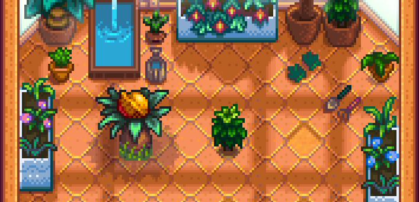
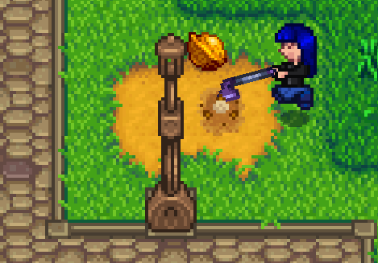
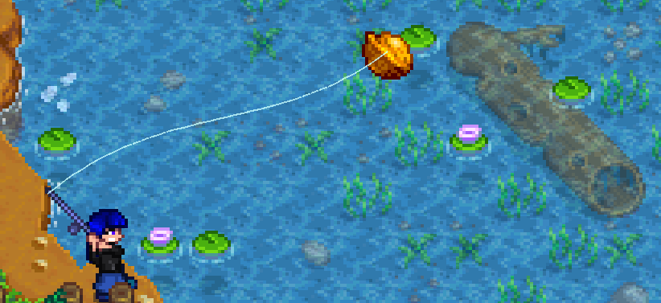
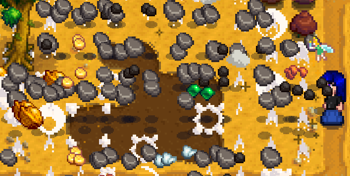
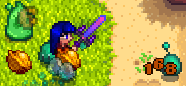
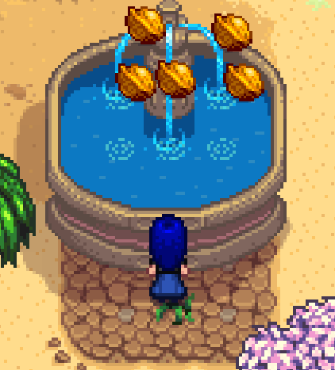

# Golden Walnut Framework (GWF)

This is a Framework Mod that lets you add custom Golden Walnuts and Parrot Upgrade Perches. You can add Walnut Bushes, bury Walnuts, drop them when you destroy a Stone and much more.
And you can add new Parrot Upgrade Perches (The Parrots that sit on a stick and where you can trade Walnuts for a Map change) and trigger Map Overrides, destroy some tiles or anything else.


## Contents
* [Installation](#installation)
* [Setting up your Content Pack](#setting-up-your-content-pack)
* [Having multiple Content Packs in one folder](#having-multiple-content-packs-in-one-folder)
* [General](#general)
* [GoldenWalnuts](#goldenwalnuts)
  * [Hint](#hint)
  * [Singular](#singular)
    * [Language Token](#language-token)
  * [ID](#id)
  * [Type](#type)
    * [Bush](#bush)
    * [Buried](#buried)
    * [Fishing](#fishing)
    * [Stone](#stone)
    * [MonsterLoot](#monsterloot)
    * [Custom](#custom)
  * [Location](#location)
  * [X and Y](#x-and-y)
  * [Width and Height](#width-and-height)
  * [ExtraTiles](#extratiles)
  * [Chance](#chance)
  * [Count](#count)
  * [DropAtOnce](#dropatonce)
  * [StoneTypes](#stonetypes)
    * [How to add custom Stones](#how-to-add-custom-stones) 
  * [MonsterTypes](#monstertypes)
  * [Secret Notes and Conditions](#secret-notes-and-conditions)
* [ParrotUpgradePerches](#parrotupgradeperches)
  * [Base Entries](#base-entries)
  * [DestroyAreas](#destroyAreas)
  * [FromFile, FromArea, ToArea](#fromfile,-fromarea,-toarea)
  * [Condition](#condition)
* [Settings](#settings)
  * [ModID and Content Patcher Compatibility](#modid-and-content-patcher-compatibility)
  * [AutomaticWalnutIDs](#automaticwalnutids)
  * [SeparateHints](#separatehints)
  * [MailFlagsForUsedWalnuts](#mailflagsforusedwalnuts) <- this one is important
  * [DisableWalnutCap](#disablewalnutcap)
  * [DisableSeasonalFeaturesForMaps](#disableSeasonalFeaturesForMaps)
  * [IgnorePathsWarning](#ignorepathswarning)
* [Console Commands](#console-commands)
  * [ShowWalnuts](#showwalnuts)
  * [RemoveWalnut](#removewalnut)
  * [ShowMailFlags](#showmailflags)
  * [RemoveMailFlag](#removemailflag)
  * [ShowAllWalnutIDs](#showallwalnutids)
  * [ShowAllStoneTypeIDs](#showallstonetypeids)
  * [/recountNuts](#recountNuts)
* [Example File](#example-file) 

## Installation
1. **Install the latest version of [SMAPI](https://smapi.io/).**
2. **Download Golden Walnut Framework** from [GitHub](https://github.com/ResoNight/GoldenWalnutFramework) or [Nexus Mods](https://www.nexusmods.com/stardewvalley/mods/???/)
3. **Unzip FarmTypeManager** into your `Stardew Valley\Mods` folder.

## Setting up your Content Pack
1. **Create a new folder** with your content pack in the Mods folder
2. **Add a content.json and a manifest.json file**
3. **for the manifest.json, follow the instructions** on the [Stardew Valley Wiki](https://stardewvalleywiki.com/Modding:Modder_Guide/Get_Started#Add_your_manifest).
4. **Add this field in your manifest.json**:
```
"ContentPackFor": {
    "UniqueID": "ResoNight.GoldenWalnutFramework"
}
```
Now start the game. Unless you see `No content.json for GoldenWalnutFramework has been found` pop up in the SMAPI Console, you're good to go!

## Having multiple Content Packs in one Folder
If you also have a **Content Pack** for **Content Patcher** or any other Framework or a **C# Mod already** in your mod folder, which you most likely have, then your
**content** and **manifest.json** for this **Content Pack** must go into a **subfolder**, as well as the folders for **every other mod or content Pack** as well.
To put it simple, if you have multiple manifest.jsons for multiple whatevers, they must all be similarly deep into the folder structure. Meaning, the data path of each
manifest.json must have the same length, or otherwise SMAPI will overlook the manifest.jsons, that lie deeper into a folder than any other manifest.json.

## General
Now you can start writing stuff into your **content.json**. There are a few things I want to mention before you jump into adding your new entries. The [Contents](#contents)
field above roughly matches the structure that your content.json will have. IDs work in a pretty unusual way, so please read [Walnut ID](#walnut-ids) and the Setting
[AutomaticWalnutIDs](#automaticwalnutids). Also if you have a Content Pack for Content Patcher (which you most likely have), please look into 
[ModID and Content Patcher Compatibility](#modid-and-content-patcher-compatibility) before you do anything else. If you are testing your implemented Walnuts, I have a bunch of error logs, so you can't do anything wrong. All entries will be checked when you start the game and they will be checked again, if you load into a save. The check for your [Location](#location) entry can only happen after loading into a save. If you are adding/changing entries in your content.json, you don't need to fully close the game and reopen it. You can just exit the save and re-enter it. You will get a little warning into your SMAPI console, when you add or remove a new [Walnut Group](#hint), but don't worry, your collected Walnut Count will just be off a bit. After restarting, it will always be correct then. Now lets get started with **GoldenWalnuts!**

## GoldenWalnuts
The Basic structure for Golden Walnuts looks like this:
```
"GoldenWalnuts": {
    "Hint1": [
        {
            //entries for walnut 1
        },
        {
            //entries for walnut 2
        },
        ...
    ],
    "Hint2": [
        ...
    ],
    ...
}
```
For each Walnut, there are those fields:
Field|Value|Description
-----|-----|-----------
[ID](#id) | string | A unique ID for walnuts. Walnuts with type [Bush](#bush) do not have an ID. IDs can be generated automatically (see below at [AutomaticWalnutIDs](#automaticwalnutids))
[Type](#type) | string | The type can either be [Bush](#bush), [Buried](#buried), [Fishing](#fishing), [Stone](#stone), [MonsterLoot](#monsterloot) or [Custom](#custom)
[Location](#location) | string | The Location of the Walnut
[X](x-and-y) | int | The X-Coordinate of the Walnut
[Y](x-and-y) | int | The Y-Coordinate of the Walnut
[Width](#width-and-height) | int | The width for the area in that the Walnut is obtainable
[Height](#width-and-height) | int | The height for the area in that the Walnut is obtainable
[ExtraTiles](#extratiles) | List with different elements (see at [ExtraTiles](#extratiles)) | additional areas in that the Walnut is obtainable (so you can assign a more specific area than just one rectangle)
[Chance](#chance) | int | The chance for the Walnut to drop. The number must be between 0 and 1.
[Count](#count) | int | The amount of walnuts that can be dropped from this Walnut entry. (assigning a Count will change the [ID](#id))
[DropAtOnce](#dropatonce) | [int, int] | The amount of walnuts that will be dropped at once. Cannot exceed the given [Count](#count)
[StoneTypes](#stonetypes) | [int or string, int or string, ...] | if assigned, only the given StoneTypes can drop a Walnut. To get a list of all possible values, use the [Console Command](#console-commands) [ShowStoneTypeIDs](#showstonetypeids). Supports custom Stone Types
[MonsterTypes](#monstertypes) | [string, string, ...] | if assigned, only the given MonsterTypes can drop a Walnut. To get a list of all possible values, open the Data/Monsters file of the game. The entries on the **left** side are the possible values. Or lookup this [table](https://stardewvalleywiki.com/Modding:Monster_data#Monster_IDs) on the Stardew Valley Wiki. The entries on the **right** side are possible values
[Condition](#secret-notes-and-conditions) | string | a [MailFlag](https://stardewvalleywiki.com/Modding:Mail_data#Mail_flags) after that the Walnut becomes obtainable, for example after reading a [Secret Note](#secret-notes-and-conditions)
[Singular](#singular) | string | lets you assign a singular form for the [Hint](#hint), if the player only has one remaining Walnut under the Hint. This is a very special field, read below at [Singular](#singular)

The only always **mandatory** field is the [type](#type). Each Walnut type has a different set of possible fields that you can assign, for example for [Bush](#bush) type Walnuts, you cannot assign an [ID](walnut-id), [MonsterLoot](#monsterloot) type Walnuts are the only type that supports the [MonsterTypes](#monstertypes) field and so on. Look for each type which kind of entries are possible and which are not.

## Hint
As you can see [above](#goldenwalnuts), each **Golden Walnut** that you add is part of a **Walnut Group** under a **Hint**. The Hint is what you can see when you
right click the Parrot in the Island Hut on IslandEast. The vanilla game writes the hints in a quite unique way, that you might want to follow. There are two ways how a Hint can
be written. The first way, is, you just write the hint and no matter how many Walnuts under this hint are remaining, it will say the same thing. But you
can also let the Parrot say the amount of remaining walnuts by adding `{0}` somewhere in the hint. So for example, if there are 5 Walnuts in a group
that you haven't collected yet, then this: 

`{0} buried in the north...` 

would automatically turn into this, when talking to the Parrot: 

`5 buried in the north...` 

***Important!*** always write `{0}` with a 0,
***NEVER*** any other number than that!

For those hints in specific, concernedApe always wrote them in a way so that the **singular** and **plural** form
are the same. So he never wrote f.e. `{0} Walnuts in the Ocean...`, since this could say `1 Walnuts in the Ocean...`. However, I just added a way so you can
write a [singular](#singular) form that will be shown instead, when you have 1 Walnut remaining of this group. The Hint field and the [Singular](#singular)
field are the only ones, that support the [Language Token](#language-token). The Setting [SeparateHints](#separatehints) might also be interesting for you. One last thing, don't make your hints too long or they might go **off screen**!

## Singular
If your [Hint](#hint) contains a `{0}` and you want to have a singular form of the string, when the player has only one remaining Walnut in this group, you can assign the Singular field. To use this field, your first "Walnut" entry must be just the field for singular. So it should look like this:
```
"YourHint": [
    {
        "Singular": "YourHintInSingularForm"
    },
    {
        //entries for Walnut 1
    },
    {
        //entries for Walnut 2
    },
    ...
]
```
The Singular field also supports the [Language Token](#language-token). This field technically also supports `{0}`, but this will always be replaced with 1, since this will only be shown if you have 1 walnut remaining.

## Language Token
For the [Hint](#hint) and its [Singular](#singular) form, you can use the language token, that works similar to how [Content Patcher's language token](https://github.com/Pathoschild/StardewMods/blob/develop/ContentPatcher/docs/author-guide/tokens.md#i18n) works. The token looks like this: `{{i18n:...}}` and for the ..., you enter the keyword that you are using in your language files. So to set everything up, create a new **Folder** called `i18n` next to your content and manifest files. In this foldeer, you add a default.json for english and then you add a file for each language that you want to add. The language files must be the language code with .json behind it, so `de.json` for german, `es.json` for spanish and so on (See the [Translation Guide](https://stardewvalleywiki.com/Modding:Translations) on the Stardew Valley Wiki). In those files, you add the keyword that you used in your token. So for example, if you have this:
```
"{{i18n:Buried_North}}": [
    {
        "Singular": {{i18n:Buried_North_S}}
    },
    ...
]
```
then your default.json would look like this:
```
{
    "Buried_North": "{0} Golden Walnuts buried in the north...",
    "Buried_North_S": "1 Golden Walnut buried in the north..."
}
```
and your, lets say de.json would look like this:
```
{
    "Buried_North": "{0} Walnüsse vergraben im Norden...",
    "Buried_North_S": "1 Walnuss vergraben im Norden..."
}
```
If you didn't add the language file the player currently uses or the language file is missing the entry for the hint that the game tries to show the player, it will just look for the entry in the default.json instead. So don't worry about missing entries or missing language files!

## ID
The ID for Golden Walnuts works in a unique way and has some edge cases. The ID that you assign here is the ID that will be added under `Game1.player.team.collectedNutTracker`. IDs should be assigned as unique as possible, so using the `{{ModID}}` token is strongly advised (see below at [ModID and Content Patcher Compatibility](#modid-and-content-patcher-compatibility)). Bushes cannot have a custom ID, because it needs a specific ID structure, so the game can connect a Walnut to a Walnut Bush. So Bushes' ID will automatically be this: `Bush_Location_X_Y`. If you assigned a [Count](#count) to a Walnut that is 2 or higher, each individual Walnut will automatically have its own ID. So if you have, lets say, Count set to 3 and your ID is "TestID", the IDs of those Walnuts will be: `TestID_1`, `TestID_2` and `TestID_3`. This is especially important if you assign a Walnut with the [Type](#type) [Custom](#custom), since you need to add the right IDs to your collectedNutTracker. You can also activate [AutomaticWalnutIDs](#automaticwalnutids) so you don't have to write an ID for each Walnut that you add ([Custom](#custom) Type Walnuts must **always** have an ID assigned to them).

## Type
There are a total of 6 Types that a Walnut can have. Each type has different fields that it **must** have, **can** have and **cannot** have. I will go through them one by one.

# Bush


Possible Fields|Status
---------------|------
[Type](#type) | required
[Location](#location) | required
[X](#x-and-y) | required
[Y](#x-and-y) | required

Example:
```
{
    "Type": "Bush",
    "Location": "Sunroom",
    "X": 3,
    "Y": 7
}
```

A **Bush** must always have those fields and cannot have any other than that. You cannot assign an [ID](#id) for Bushes, since I need to automatically generate the ID so that the game can connect the Walnut to the Bush. For this example, the ID of the Walnut would be `Bush_Sunroom_3_7`. On the Paths TileSheet when creating maps, there is a tile that lets you spawn in Walnut Bushes. ***DO NOT USE THIS!*** Adding a Walnut with Type Bush will spawn it in automatically. When you place them yourself, the Framework cannot keep track of them! What you can do though is place the tile with index 7 from the paths TileSheet on the Paths layer (see [Paths Layer](https://stardewvalleywiki.com/Modding:Maps#Paths_layer) on the Wiki). This is a tile that does not have any effect at all, so it is good for yourself to keep track, where you placed Bushes. One more thing, just like normal Bushes, spawning a Bush once will let it stay in the save file. However, you don't have to worry about that. You will occasionally see a `x Bushes removed` in the console, since GWF automatically removes any Walnut Bushes that have been placed using the framework, but don't have any matching entry currently.

# Buried


Possible Fields|Status
---------------|------
[ID](#id) | required (optional if [automaticWalnutIDs](#automaticWalnutIDs) is enabled)
[Type](#type) | always required
[Location](#location) | always required
[X](#x-and-y) | always required
[Y](#x-and-y) | always required
[Count](#count) | optional
[Condition](#secret-notes-and-conditions) | optional

Example:
```
{
    "ID": "{{ModID}}_Buried_Town_01"
    "Type": "Buried",
    "Location": "Town",
    "X": 25,
    "Y": 51
}
```

A **Buried Walnut** works pretty much exactly how you think it would work. If you assign a Count, all those Walnuts will be dropped at once. Especially for buried walnuts, the *Condition* field might be very useful to f.e. only let a walnut be dropped *after* the player has read a **Secret Note**. GWF does *not* provide a framework for Secret Notes, so see below at [Secret Notes and Conditions](#secret-notes-and-conditions). Keep in mind that the tile for your walnut must be *diggable*.

# Fishing


Possible Fields|Status
---------------|------
[ID](#id) | required (optional if [automaticWalnutIDs](#automaticWalnutIDs) is enabled)
[Type](#type) | always required
[Location](#location) | always required
[X](#x-and-y) | optional (required for [automaticWalnutID](#automaticWalnutIDs))
[Y](#x-and-y) | optional (required for [automaticWalnutID](#automaticWalnutIDs))
[Width](#width-and-height) | optional
[Height](#width-and-height) | optional
[ExtraTiles](#extratiles) | optional
[Count](#count) | optional
[Chance](#chance) | optional
[Condition](#secret-notes-and-conditions) | optional

Example:
```
{
    "ID": "{{ModID}}_Fishing_Mountain_Log",
    "Type": "Fishing",
    "Location": "Mountain",
    "X": 66,
    "Y": 31,
    "Width": 6,
    "Height": 6,
    "Chance": 0.25,
    "Count": 3
}
```

Fishing Type Walnuts can either be fished across a whole map or they can be in specific areas. With the [X and Y](#x-and-y) Coordinates as wellas the [Width](#width-and-height) and [Height](#width-and-height), you can assign a rectangle in that the walnut can be fished. If you need a more specific area, you can use the field [ExtraTiles](#extratiles). If you assign a [Count](#count) and the last Walnut is being fished, the game will play a small soundeffect, so that the player knows, that he got all walnuts of one entry. The [DropAtOnce](#dropatonce) feature unfortunately does not work for **Fishing** type walnuts, since you are actively fishing one walnut instead of x walnuts being dropped into the world. For the [Chance](#chance), please keep in mind that the player is fishing pretty slowly and you can only fish one at a time. So whereas a 0.05 chance for a [Stone](#stone) type Walnut in a larger quarry would be perfectly reasonable, a 0.05 chance for fishing, especially if you assign a Count like 5, would be terrifyingly frustrating. So, in short, think of what you are doing and always think of the unlucky ones :) You can also assign a Condition (see below at [Secret Notes and Conditions](#secret-notes-and-conditions)).

# Stone


Possible Fields|Status
---------------|------
[ID](#id) | required (optional if [automaticWalnutIDs](#automaticWalnutIDs) is enabled)
[Type](#type) | always required
[Location](#location) | always required
[X](#x-and-y) | optional (required for [automaticWalnutID](#automaticWalnutIDs))
[Y](#x-and-y) | optional (required for [automaticWalnutID](#automaticWalnutIDs))
[Width](#width-and-height) | optional
[Height](#width-and-height) | optional
[ExtraTiles](#extratiles) | optional
[Count](#count) | optional
[DropAtOnce](#dropatonce) | optional
[Chance](#chance) | optional
[StoneTypes](#stonetypes) | optional
[Condition](#secret-notes-and-conditions) | optional

Example:
```
{
    "ID": "{{ModID}}_MountainQuarry",
    "Type": "Stone",
    "Location": "Mountain",
    "Chance": 0.05,
    "Count": 10,
    "DropAtOnce": [1, 3]
}
```

This type causes Stones to drop Walnuts if you break them in any way, just like the MusselStones on IslandWest. You can assign a **rectangle** using [X, Y](#x-and-y), [Width](#width-and-height) and [Height](#width-and-height). If you need a more specific area, you can use the field [ExtraTiles](#extratiles). If you leave all of them out, the area will just be the whole map. If you assign a Count, the game will play a soundeffect whenever the player collects the last walnut from one entry. For Stones, you can also assign the DropAtOnce field. Whenever the Stone is going to drop Walnuts, it will drop a random amount of walnuts between your left and right number. So in the case of the example, a stone will drop 1, 2 or 3 walnuts at once. However, the [Count](#count) you assigned will always be the upper limit. So for example if you assign something like this: `"DropAtOnce": [3, 5]` with the Count 10 and 9 out of 10 Walnuts have already been dropped, the last Stone will forcefully drop only 1 Walnut. There is also the field [StoneTypes](#stonetypes) which, when set, only lets the given Stones drop Walnuts, including Custom Stones (see below at [StoneTypes](#stonetypes). For the [Chance](#chance) field, you should really think about how you are going to set this. You have to consider the size of your quarry, the amount of stones that can drop walnuts, the amount that can be dropped at once and the bad luck of some players. For example my example from above was actually not that good. Upon testing, in 10 out of 10 cases with a full quarry, I got the 10 Walnuts, often with the very first bomb. So for above's example, I would completely leave out DropAtOnce and then I would say it would be decently balanced. So maybe you want to go out and just test, what Chance you want to set. This Walnut Type also supports the Condition field (see below at [Secret Notes and Conditions](#secret-notes-and-conditions)).

# MonsterLoot


Possible Fields|Status
---------------|------
[ID](#id) | required (optional if [automaticWalnutIDs](#automaticWalnutIDs) is enabled)
[Type](#type) | always required
[Location](#location) | always required
[X](#x-and-y) | optional (required for [automaticWalnutID](#automaticWalnutIDs))
[Y](#x-and-y) | optional (required for [automaticWalnutID](#automaticWalnutIDs))
[Width](#width-and-height) | optional
[Height](#width-and-height) | optional
[ExtraTiles](#extratiles) | optional
[Count](#count) | optional
[DropAtOnce](#dropatonce) | optional
[Chance](#chance) | optional
[MonsterTypes](#monstertypes) | optional
[Condition](#secret-notes-and-conditions) | optional

Example:
```
{
    "ID": "{{ModID}}_Moonscythe_Island_MonsterLoot",
    "Type": "MonsterLoot",
    "Location": "{{ModID}}_Moonscythe_Island",
    "Count": 5,
    "DropAtOnce": [1, 2],
    "Chance": 0.25,
    "MonsterTypes": ["Sludge"]
}
```

To make it short, this Type works basically *exactly* like the [StoneTypes](#stonetypes) walnut. Keep in mind, the area that you assign with [X, Y](#x-and-y), [Width](#width-and-height) and [Height](#width-and-height) refers to the last tile on which the monster has been killed, **NOT** where you spawned the monster (since I cannot trace back where a monster has been spawned). You can also specify, which kind of monsters can drop Walnuts by using the [MonsterTypes](#monstertypes) field. One more thing, I hope this is already clear, but if you f.e. spawn in monsters using [FarmTypeManager](https://github.com/Esca-MMC/FarmTypeManager), ***DO NOT*** add a Walnut as loot. This framework handles the loot on its own, you don't need to add it

# Custom


Possible Fields|Status
---------------|------
[ID](#id) | always required
[Type](#type) | always required
[Count](#count) | optional

Example:
```
{
    "ID": "{{ModID}}_F_Island_FountainWalnuts",
    "Type": "Custom",
    "Count": 5
}
```

If you want to give the player Walnuts in any other way than the options from above, you can do this (This is C# territory). By adding a Custom Type walnut, you just synchronize your walnut with the whole walnut calculation and hint system. So, lets say, you add a fountain that gives you 5 Walnuts, if you throw a specific item in there. The whole item throwing in is your job. If you want to let a walnut drop on the ground, you can use something like this:
```Game1.createItemDebris(ItemRegistry.Create("(O)73"), new Vector2(Xf, Yf) * 64f, Game1.random.Next(4), null);```
The item 73 is the golden Walnut. The vector is the pixels. One tile contains of 64*64 pixels from the mechanical perspective, so multiplying that vector by 64 gives you the Tile. This means, you can also let a Walnut drop at half a tile or pretty much wherever you want. Game1.random.Next(4) gives you a random number between 0 and 3, which are the 4 directions. So if you want the Walnut to be dropped to the top (like in the fountain image above), you would want to enter 0 (0 is up, 1 is right, 2 is down, 3 is left). the null is the location, which defaults to Game1.player.currentLocation. So normally null works fine, but if you let the walnut being dropped through the host for example, you might want to enter something else there. So this lets you drop in a Golden Walnut. When you don't want to drop it on the floor, you need to know that, when the game adds a Golden Walnut to your inventory, it instantly deletes it again and increases your Walnut Count by 1. So adding a Walnut to the Inventory in any way will increase the collected amount automatically. However, the Walnut itself does not contain any data like an ID whatsoever. Actually, the Walnut itself never has an ID or something, the game just drops a Walnut and *simultaneously* mark it as collected. So, theoretically, if you drop a walnut and somehow manage to not collect it (which is usually basically impossible), the game actually marks it as collected, even though you haven't collected the Walnut. So because of this, you can just drop the walnut like above and then you have to mark the Walnut as collected. To do this. lets take this entry as an example:

```
{
    "Type": "Custom"
    "ID": "{{ModID}}_CasinoPrize"
}
```
And lets say your ModID is this: `ResoNight.IslandExpansion` (Using {{ModID}} is not technically necessary, but strongly advised), then you would have to mark the Walnut as collected by doing this:
```Game1.player.team.collectedNutTracker.Add("ResoNight.IslandExpansion_CasinoPrize")```
But this is only the right way if you have no [Count](#count) assigned. If we go back to my example from above:
```
{
    "ID": "{{ModID}}_F_Island_FountainWalnuts",
    "Type": "Custom",
    "Count": 5
}
```
you have to keep in mind that the [ID](#id) for the Walnut is slightly getting changed. The required IDs are always this:
```
ID_1
ID_2
ID_3
... //up until the Count
```
Therefore, in the case of my fountain example, I do this instead:
```
Game1.player.team.collectedNutTracker.Add("ResoNight.IslandExpansion_FountainWalnuts_1")
Game1.player.team.collectedNutTracker.Add("ResoNight.IslandExpansion_FountainWalnuts_2")
Game1.player.team.collectedNutTracker.Add("ResoNight.IslandExpansion_FountainWalnuts_3")
Game1.player.team.collectedNutTracker.Add("ResoNight.IslandExpansion_FountainWalnuts_4")
Game1.player.team.collectedNutTracker.Add("ResoNight.IslandExpansion_FountainWalnuts_5")
```
or in short:
```
for (int i = 1; i <= 5;  i++)
{
    Game1.player.team.collectedNutTracker.Add($"ResoNight.IslandExpansion_F_Island_FountainWalnuts_{i}");
}
```
Keep in mind, if you are doing a loop like this, you should let i go from 1 to 5, not 0 to 4 (you could also write i + 1 in the ID if you like that more). This would mark all of the Walnuts as collected at once. But of course, sometimes you do not want to add all of them at once. Lets say you have a shop, where you can buy Golden Walnuts and lets say this trade exists 5 times. Then you would have a JSON entry like this:
```
{
    "ID": "{{ModID}}_CasinoTrade",
    "Type": "Custom",
    "Count": 5
}
```
How you do the shopping part itself is on your side. Important is, when someone buys a Walnut (which automatically itself tries to put it into the inventory, where it increases the current amount already on its own), you should do a loop like this:
```
for (int i = 1; i <= 5; i++)
{
    string id = "ResoNight.IslandExpansion_CasinoTrade_" + i;
    if (!Game1.player.team.collectedNutTracker.Contains(id)
    {
        Game1.player.team.collectedNutTracker.Add(id);
        break;
    }
}
```
As you can see, I really want to make sure that you do it the right way XD. If you ever need to look up the Walnuts that the player currently has, you can type [ShowWalnuts](#showwalnuts) into the SMAPI console and you get a list of them. The rest is on you. As long as you properly mark the Walnuts as collected in the **NutTracker** and you make sure that even in multiplayer, a walnut cannot accidentally be dropped multiple times (since you wouldn't get any warning or error of any kind for that), everything should be fine. Now we are through with all the possible values for the [Type](#type) field. Now we can go on with the other fields.

# Location
For the location field, there are a few things to keep in mind. First, whenever you start the game, you can already see an error for each entry. The location entry is the only thing that can check for errors after you loaded into a save, since GWF needs to check for existing locations. For the location field, you need to add the name that the in-game location has, NOT the name of its file. So for example there is the file `Island_N`, but the location is named `IslandNorth` and you need to write *IslandNorth* into the locations field. If you don't know the name of a location, there are a few ways to find the name. First, you can go into the Data/Maps field and actively look for the name in there. But this can be a bit annoying sometimes. So if you have the Mod FarmTypeManager installed, you can just go to the location and type `whereami` into the console and it will tell you the name of the location. Or probably the easiest way, you look at this [table](https://stardewvalleywiki.com/Modding:Location_data#Location_names) from the Wiki. Everything about the location entry is similar for the Locations field for [Golden Walnuts](#goldenwalnuts) and for [Parrot Upgrade Perches](#parrotupgradeperches).

# X and Y
Those two fields are pretty self-explanatory. However, one good thing to know, is, that if you have [AutomaticWalnutIDs](#automaticwalnutids) enabled, those two fields become necessary, since the generated ID is always this: `ModID_Type_Location_X_Y`.

# Width and Height
With the Width and Height, you can specify an area for a walnut in that it can be dropped. Just keep in mind that if for example your X coordinate is 40 and you want the area to reach up to 45, your Width must be 6 and not 5, since the X coordinate itself also has Width 1 basically. The rest should be self-explanatory

# ExtraTiles
This field lets you add extra areas, if your designated area cannot just be a rectangle. The entries of this field must look like this:
```
"ExtraTiles": [
    {
        "X": 23,
        "Y": 48,
        "Width": 3,
        "Height": 2
    },
    {
        "X": 22,
        "Y": 47,
        "Width": 2
    },
    ...
]
```
For each {}, you can assign the [X and Y](x-and-y) coordinates and optionally also the [Width and Height](#width-and-height). If one of those or both are omitted, they just default to 1.

# Chance
The chance is a number between 0 and 1. Genuinely think about what chance you can assign, it can quickly get frustrating, if someone is unlucky. And if many people play your mod, there *will* be unlucky people. For Fishing walnuts especially, you shouldn't make the chance too low, because you have to actively spent a ton of ingame time to get a chance one by one, whereas for monsters and stones, you can quickly go in, kill them once or destroy them once and then you got your chance for today, so fishing is generally much more frustrating than the other types.

# Count
If you assign a Count to a Walnut, the ID gets changed a bit. Instead of one walnut having the [ID](#id) that you assigned (or that is automatically generated (see below at [AutomaticWalnutIDs](#automaticWalnutIDs)), each walnut gets its own individual ID, that is simply ID_1, ID_2, ID_3 and so on, up until your Count. The Count that you assign always determine the upper limit of how many walnuts you can get from this Walnut entry (So the field [DropAtOnce](#dropatonce) cannot exceed this limit)). For [Buried](#buried) Walnuts, all Walnuts will be dropped at once. For each other Walnut, you can get the Walnuts one at a time. If the player collects the last Walnut of a Walnut entry, the game will play a little soundeffect ("jingle1" if you are interested). Setting the Count to 1 is completely pointless, just don't. It will *NOT* change the ID to ID_1 in that case.

# DropAtOnce
A valid entry for this field must look like this:

`[lower border, upper border]`

So for example this:

`[1, 3]`

Even if you always want to drop the same amount, please also write it like this: `[2, 2]`. The [Count](#count) field always has priority over the DropAtOnce field. This means, if you'd assign for example this: `[3, 3]` and your Count is 10, the first three stones or monster or whatever would drop 3 Walnuts and the last one would drop 1.

# StoneTypes

If you assign this field, only the given **StoneTypes** can drop a Walnut in the area you assigned, instead of every stone in an area being able to drop a Walnut. Possible values are integers and strings, since the ID of some stones are strings. An example entry would look like this:

`[2, 4, 6, 8, 10, 12, 14, "{{ModID}}_ExpStoneNode"]`

These IDs are all the gem stones as well as a custom Stone that I used for example. The IDs are the entries in the `Data/Objects.json` file from the game. If you want to know, which Node has which ID, just type [ShowStoneTypeIDs](#showstonetypeids) into the smapi console and GWF will list you all of them as well as some minor explanations, which is which. I just added this because it is a bit annoying to find this out on your own.

# How to add custom Stones

This is normally something that lies outside of GWF, but I still want to briefly explain, how you can do it, since you have to do some workaround that I could only figure out with the help of **Esca**, the creator of the Framework Mod [FarmTypeManager](https://github.com/Esca-MMC/FarmTypeManager). So first of all, you need to add the Node as an Object into the Object.json. In your [Content Patcher](https://github.com/Pathoschild/StardewMods/tree/develop/ContentPatcher) Content Pack (what a sentence), you just do for example this:
```
{
    "Action": "EditData",
    "Target": "Data/Objects",
    "Entries": {
        "{{ModID}}_ExpStoneNode": {
            "Name": "Stone",
            "DisplayName": "ExpStoneNode",
            "Description": "ExpStoneNode",
            "Type": "Litter",
            "Category": -999,
            "Price": 0,
            "Texture": "LooseSprites/{{ModID}}_Objects",
            "SpriteIndex": 3,
            "ColorOverlayFromNextIndex": false,
            "Edibility": -300,
            "IsDrink": false,
            "Buffs": null,
            "GeodeDropsDefaultItems": false,
            "GeodeDrops": null,
            "ArtifactSpotChances": null,
            "CanBeGivenAsGift": true,
            "CanBeTrashed": true,
            "ExcludeFromFishingCollection": false,
            "ExcludeFromShippingCollection": false,
            "ExcludeFromRandomSale": false,
            "ContextTags": null,
            "CustomFields": null
        }
    }
},
{
    "Action": "Load",
    "Target": "LooseSprites/{{ModID}}_Objects",
    "FromFile": "assets/Others/Custom_Objects.png"
},
```

What you can see here, is, first, I add the entry to the Object.json. Then I load in the texture png file, so that the `"Texture"` field can find the texture. The important thing here is, make sure that the Field `"Name"` has the Value `"Stone"`. This makes the game recognize the object as a stone. This means, it can now be broken with a pickaxe and it has the default breaking animation. Unfortunately, this also defaults the stone's dropped item to a regular stone (or multiple of them). Maybe you can figure out, how to change/get rid of the normal stone drop. I couldn't. So I can just tell you how to add a drop and you do this by adding this line in your ModEntry:
```helper.Events.World.ObjectListChanged += World_ObjectListChanged;```
And then you do this function:
```
private void World_ObjectListChanged(object? sender, ObjectListChangedEventArgs e)
{
    foreach (var removedObj in e.Removed)
    {
        if (removedObj.Value.ItemId.ToString() == "ResoNight.IslandExpansion_ExpStoneNode")
        {
            Game1.createItemDebris(ItemRegistry.Create("ResoNight.IslandExpansion_ExpStone"), new Vector2(removedObj.Key.X * 64f, removedObj.Key.Y * 64f), Game1.random.Next(4));
        }
    }
}
```
Of course, you have to change the Item ID, that the if checks for, to the ID that you gave your own Stone and the ID of the Item that you want to be dropped. Of course you can also add a chance to this, this code just always drops 1 of this item, 100% of the time. So with all this, you added an Object that is breakable and that will drop an item of your choice. Now you need to actually spawn the Stone in. You can obviously also do this with C#, but if you want the whole Quarry spawning logic, [FarmTypeManager](https://github.com/Esca-MMC/FarmTypeManager) definitely makes your life easier. However, there is a problem. The field [Ore_Spawn_Settings](https://github.com/Esca-MMC/FarmTypeManager#ore-spawn-settings) only works with vanilla Nodes. So you are going to spawn the Nodes in using the [Forage_Spawn_Settings](https://github.com/Esca-MMC/FarmTypeManager#forage-spawn-settings). So normally, you would have an entry for the items to spawn in like this:
```
"SpringItemIndex": [
    "ResoNight.IslandExpansion_ExpFlower"
],
"SummerItemIndex": [
    "ResoNight.IslandExpansion_ExpFlower"
],
"FallItemIndex": [
    "ResoNight.IslandExpansion_ExpFlower"
],
"WinterItemIndex": [
    "ResoNight.IslandExpansion_ExpFlower"
],
```
(If you wonder, in my case, the map has no seasons and therefore I spawn in the same plant in all seasons). But now, if you want to spawn in the Nodes, you must do something like this instead:
```
"SpringItemIndex": [
          {
            "Category": "Object",
            "Name": "ResoNight.IslandExpansion_ExpStoneNode",
            "CanBePickedUp": false
          }
        ],
        "SummerItemIndex": [
          {
            "Category": "Object",
            "Name": "ResoNight.IslandExpansion_ExpStoneNode",
            "CanBePickedUp": false
          }
        ],
        "FallItemIndex": [
          {
            "Category": "Object",
            "Name": "ResoNight.IslandExpansion_ExpStoneNode",
            "CanBePickedUp": false
          }
        ],
        "WinterItemIndex": [
          {
            "Category": "Object",
            "Name": "ResoNight.IslandExpansion_ExpStoneNode",
            "CanBePickedUp": false
          }
        ],
```
This, as you can probably guess, prevents the Node from being picked up. And this is the last necessary piece to add Custom Stones. And coming back to GWF, if you add Custom Stones, you can also use its ID in the [StoneTypes](#stonetypes) field. So for example you could pixel a "Walnut Stone" or something and add it to the Quarry on IslandNorth, just to give you some ideas.

# MonsterTypes
If you assign the **MonsterTypes** field, only the given **MonsterTypes** in your assigned area can drop a Walnut. This basically looks for monster classes, so even if you add custom monsters, they can still be referred to by its category. The list of available Monster types can be seen on the [Monsters](https://stardewvalleywiki.com/Modding:Monster_data#Monster_IDs) page on the wiki. The table that you see there all the way to the bottom shows all types of Monsters. Keep in mind, the entry that you must enter here is always the ID, so the entry on the right side of the table. This means that for example for the monster that is usually called dust sprite, you must take the ID called "Dust Spirit" instead. Unfortunately though, if you add multiple monsters with different textures that have the same type, there is no way to make only one of them drop walnuts.

# Secret Notes and Conditions
The **condition** field lets you set a Mailflag as a condition after that the Walnut becomes available. Whereas you can do this for practically any reason, the most obvious reason is definitely by using a Secret Note. GWF does *not* provide a framework for Secret Notes, because [Secret Note Framework](https://github.com/ichortower/SecretNoteFramework) by ichortower already exists and it already has every feature one could ask for. So if you want to use that framework, please read through its author guide. So lets say you already have a working Secret Note. This Secret Note now must have this field:
```
"ActionsOnFirstRead": [
    "AddMail Host {{ModID}}_HasSeen_SecretNote_F_Island_1 Received"
]
```
And this condition here: `{{ModID}}_HasSeen_SecretNote_F_Island_1` is what you add for the Walnut in the Conditions field. Keep in mind that you always do AddMail Host, since everything works through the Host for GWF. And by using *Received* at the end instead of now or tomorrow or something, the game knows that you just want to add the Mailflag, not a whole Mail. Also, if you use the `{{ModID}}` token here and in your conditions field, make sure that the ModID is synchronized (see [ModID and Content Patcher Compatibility](#modid-and-content-patcher-compatibility)). One more thing. Whereas a Walnut can have a condition, the [Hint](#hint) *cannot*. So for example if you added the Hint `{0} buried in the north west...`, but one of those walnuts has a condition, this walnut will still be represented in the number that is being shown, no matter if the player can or cannot collect it yet. So the player could have the parrot say `1 buried in the north west...`, but he cannot collect any. This is why you should never have a group of walnuts that has walnuts with and without a condition. So the best way for Walnuts with a condition would be something like `{0} Walnuts hidden in Secret Notes...` or something. The code for Hints is surprisingly rigid and annoying to work with, so maybe for a future version, I might change that. But as of now, keep in mind that for the Hint, Walnuts with a condition are treated just like Walnuts without a condition.

## ParrotUpgradePerches
