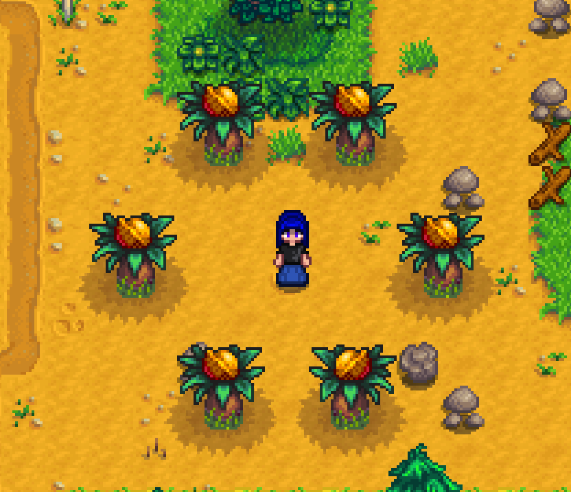
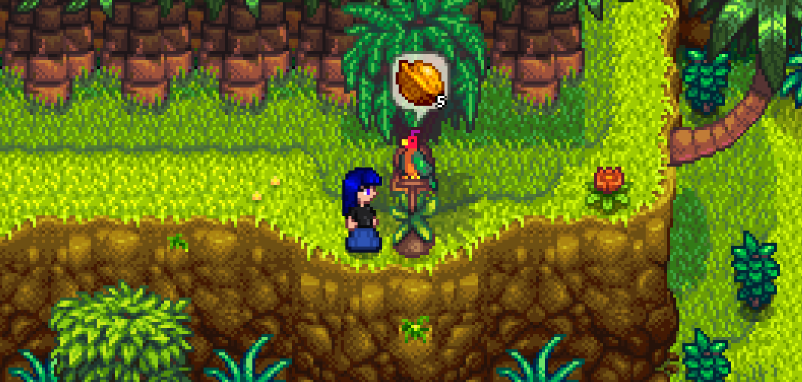
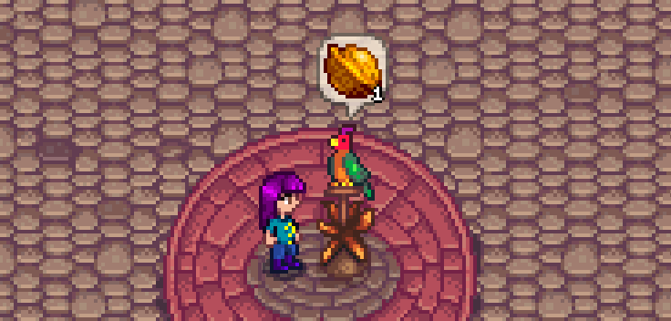
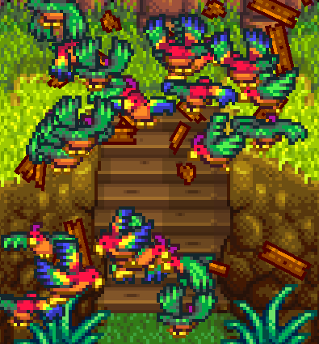
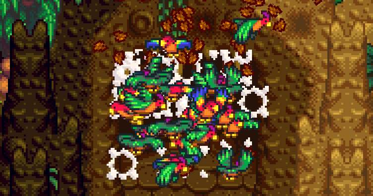
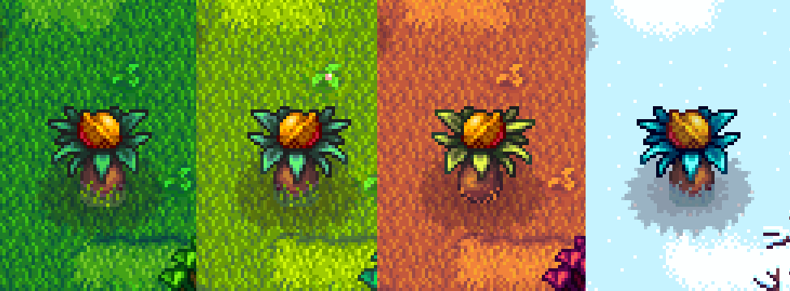

# Golden Walnut Framework (GWF) Author Guide



This is a Framework Mod that lets you add custom Golden Walnuts and Parrot Upgrade Perches. You can add Walnut Bushes, bury Walnuts, drop them when you destroy a Stone and much more. And you can add new Parrot Upgrade Perches (The Parrots that sit on a stick and where you can trade Walnuts for a Map change) and trigger Map Overrides, destroy some tiles or anything else. This guide explains, how you have to do everything when you are working with [Content Patcher](https://www.nexusmods.com/stardewvalley/mods/1915). If you are just making a Mod via C#, I must say, I have no idea how all this works. I assume though that you know yourself how to add entries into a jsonfile, if you are already deciding to not use Content Patcher for some reason. Just note that the Target file is `Mods/GoldenWalnutFramework/Data`.


## Contents
* [Installation](#installation)
* [Setting up your Content Pack](#setting-up-your-content-pack)
* [General](#general)
* [GoldenWalnuts](#goldenwalnuts)
  * [Unique Key](#unique-key)
    * [Hint](#hint)
    * [Singular](#singular)
    * [SeparateHint](#separatehint)
    * [ShowThisHint](#showthishint)
    * [HintConditions](#hintconditions)
    * [Walnuts](#walnuts)
      * [ID](#id)
      * [Type](#type)
        * [Bush](#bush)
        * [Buried](#buried)
        * [Fishing](#fishing)
        * [Stone](#stone)
        * [MonsterLoot](#monsterloot)
        * [Custom](#custom)
      * [Location](#location)
      * [X and Y](#x-and-y)
      * [Areas](#areas)
      * [Chance](#chance)
      * [Count](#count)
      * [DropAtOnce](#dropatonce)
      * [StoneTypes](#stonetypes)
        * [How to add custom Stones](#how-to-add-custom-stones) 
      * [MonsterTypes](#monstertypes)
      * [Conditions](#conditions)
* [ParrotUpgradePerches](#parrotupgradeperches)
  * [ID (PUP)](#id-pup)
  * [Location (pup)](#location-pup)
  * [Nuts](#nuts)
  * [ParrotTile](#parrottile)
  * [StickType](#sticktype)
  * [ParrotArea](#parrotarea)
  * [StoneAnimation](#stoneanimation)
  * [DestroyAreas](#destroyareas)
  * [FromFile, FromArea, ToArea](#fromfile-fromarea-toarea)
  * [Condition](#condition)
* [Settings](#settings)
  * [DisableWalnutCap](#disablewalnutcap)
  * [DisableSeasonalFeaturesForMaps](#disableseasonalfeaturesformaps)
  * [SpentWalnuts](#spentwalnuts) <- this one is important
* [Console Commands](#console-commands)
  * [ShowWalnuts](#showwalnuts)
  * [RemoveWalnut](#removewalnut-walnutid)
  * [ShowMailFlags](#showmailflags)
  * [RemoveMailFlag](#removemailflag-mailflag)
  * [ShowAllWalnutIDs](#showallwalnutids)
  * [ShowStoneTypeIDs](#showstonetypeids)
  * [/recountNuts](#recountnuts)
  * [Other useful Commands](#other-useful-commands)
* [GameStateQueries](#gamestatequeries)
* [Example File](#example-file) 

## Installation
1. **Install the latest version of [SMAPI](https://smapi.io/).**
2. **Download Golden Walnut Framework** from [Nexus Mods](https://www.nexusmods.com/stardewvalley/mods/???/)
3. **Unzip Golden Walnut Framework** into your `Stardew Valley\Mods` folder.

## Setting up your Content Pack
1. **Setup a Content Pack for ContentPatcher** (see [Author Guide for Content Patcher](https://github.com/Pathoschild/StardewMods/blob/stable/ContentPatcher/docs/author-guide.md#readme))
3. **Add this field in your content.json:**
```
{
    "Action": "EditData",
    "Target": "Mods/GoldenWalnutFramework/Data",
    "Entries": {
        //Here goes all the entries
    }
}
```


One small tip, you might want to have all your content in a separate file, so you can write something like this into your content.json:
```
{
    "Action": "Include",
    "FromFile": "code/GoldenWalnuts.json" //the path to your new file, relative to the content.json file.
}
```
and then you can write all your entries into that separate file.

# General
Now you can start writing stuff into the **Entries** field. There are a few things I want to mention before you jump into adding your new entries. The [Contents](#contents)
field above roughly matches the structure that your entries will have. Most entries will be checked as soon as you start the game, but the check for the [Location](#location) fields can only happen *after* loading into a save. Every single entry is case insensitive. Only what you enter as a value might be case sensitive. Now lets get started with **GoldenWalnuts!**

# GoldenWalnuts
The Basic structure for Golden Walnuts looks like this:
```
"GoldenWalnuts": {
    "UniqueKey1": {
        "Hint": "...",
        "Singular": "...", //optional
        "SeparateHint": true/false, //optional
        "ShowThisHint": true/false, //optional
        "HintConditions": "AnyGameStateQuery" //optional
        "Walnuts": [
            {
                //Entries for the first walnut
            },
            {
                //Entries for the second walnut
            }
            ...
        ]
    },
    "UniqueKey2": {
        ...
    }
    ...
}
```


## Unique Key
This is just a unique key that you must assign, that stands for one walnut group. Make this as unique as possible to avoid conflicts with other mods. Using the `{{ModID}}` token is strongly advised (see [ModID in Content Patcher](https://github.com/Pathoschild/StardewMods/blob/develop/ContentPatcher/docs/author-guide/tokens.md#ModId)).

## Hint
The Hint is what you will see when you right click the Parrot in the Island Hut on IslandEast. Using the [Language Token](https://github.com/Pathoschild/StardewMods/blob/develop/ContentPatcher/docs/author-guide/tokens.md#i18n) is strongly advised, even if you are not planning to add other languages. Using this token makes it possible for other people to add a translation for your mod. For simplicity, the rest of this Guide will not use this token. The vanilla game writes the hints in a quite unique way, that you might want to follow. There are two ways how a Hint can
be written. The first way is, you just write the hint and no matter how many Walnuts under this hint are remaining, it will say the same thing. But you
can also let the Parrot say the amount of remaining walnuts by adding `{0}` somewhere in the hint. So for example, if there are 5 Walnuts in a group
that you haven't collected yet, then this: 

`{0} buried in the north...` 

would automatically turn into this, when talking to the Parrot: 

`5 buried in the north...` 

***Important!*** always write `{0}` with a 0, ***NEVER*** any other number than that!

For those hints in specific, concernedApe always wrote them in a way so that the **singular** and **plural** form
are the same. So he never wrote f.e. `{0} Walnuts in the Ocean...`, since this could say `1 Walnuts in the Ocean...`. However, I just added a way so you can
write a [singular](#singular) form that will be shown instead, when you have 1 Walnut remaining of this group. One last thing, don't make your hints too long or they might go **off screen**! To test how a Hint looks on the screen, you can set [ShowThisHint](#showthishint) to true for one hint.

## Singular
If your [Hint](#hint) contains a `{0}` and you want to have a singular form of the string, when the player has only one remaining Walnut in this group, you can assign the Singular field. Using the [Language Token](https://github.com/Pathoschild/StardewMods/blob/develop/ContentPatcher/docs/author-guide/tokens.md#i18n) is strongly advised. This field technically also supports `{0}`, but this will always be replaced with 1, since this will only be shown if you have 1 walnut remaining.

## SeparateHint
There are two separate pools of [Hints](#hint) that work a bit differently. There is the vanilla pool, where there is one hint per day. This is where your Hints usually get put into. However, when you set "SeparateHint": true, your Hint will be shown **after** a Hint from the main pool. And for the separate pool, whenever the player has collected all Walnuts from the hint for the day, another hint will be generated, instead of the Parrot not saying anything at all for the rest of the day. It is generally recommended to assign this for either none or all of your hints, but you don't have to.

## ShowThisHint
This is a specific setting, just to test things. When you set "ShowThisHint": true for a hint, the Hint of the first day when you load into a save will be overwritten by the hint for that you assigned this field. The hints for the coming days will work as usual. You can assign this field for only one hint at a time. Once for a Hint from the normal pool and once for a Hint that has [SeparateHint](#separatehint) set to true. DO NOT forget to remove this field before uploading your Mod!

## HintConditions
This field lets you set a [GameStateQuery](#gamestatequeries) as a condition, after that the [Hint](#hint) can appear at the Parrot in the hut. For example like this:

`PLAYER_HAS_MAIL Host ThisIsAMailFlagYey Received`

This field works just like the [conditions](#conditions) field for walnuts, I hope that the naming just makes things less confusing. It is a usual "Conditions" field like most other mods. Also all Walnuts within this group will automatically have this as a condition as well, so the player **cannot** collect Walnuts of still unavailable hints. But one important thing is, while it might sound odd, I would probably not recommend using this field. First of all, the player is most likely not aware of even the possibility of conditional hints. So depending on what you are doing, you should maybe think of telling the player in some way. And also, when a player is getting no hints anymore but has missing walnuts, it can be a little frustrating, because it is literally the point of the hint to tell the player where the rest is. So I guess one good way to use this field would be for example, you add an event with the wizard and he spawns in 100 new walnuts in the valley and then you give all your hints this event as a condition. Or maybe you could make a questline where you let the wizard say something like "after you found 30 Walnuts, I will hide some more for you". Just something where the player would naturally know that there are new hints/obtainable Walnuts now. You also have to keep in mind that this only gives your Hint the *chance* to appear, it will not appear for sure, since you have to keep in mind that both [Hintpools](#separatehint) are shared by all mods. So for example while you could chain Hints together using the added "COMPLETED_WALNUTGROUP xy" [GameStateQuery](#gamestatequeries), you must keep in mind that the player might have to wait multiple days before he can get your new hint. Also the player doesn't have to actually see your hint for the Walnuts to become obtainable, which could also lead to some unintuitive situations. So, to summarize all this, you should really try to be a good game designer and think, what feels natural and what is fun for the player. This field is bad gamedesign most of the times, but it *can* be used well, if you really think how to use it properly.

# Walnuts
For each Walnut, there are those fields:
Field|Value|Description
-----|-----|-----------
[ID](#id) | string | A unique ID for a Walnut
[Type](#type) | string | The type can either be [Bush](#bush), [Buried](#buried), [Fishing](#fishing), [Stone](#stone), [MonsterLoot](#monsterloot) or [Custom](#custom)
[Location](#location) | string | The Location of the Walnut
[X](x-and-y) | int | The X-Coordinate of the Walnut
[Y](x-and-y) | int | The Y-Coordinate of the Walnut
[Areas](#areas) | List with different elements (see at [Areas](#areas)) | Areas in that the Walnut is obtainable
[Chance](#chance) | float | The chance for the Walnut to drop. The number must be between 0 and 1.
[Count](#count) | int | The amount of walnuts that can be dropped from this Walnut entry. (assigning a Count will change the [ID](#id))
[DropAtOnce](#dropatonce) | int or string | The amount of walnuts that will be dropped at once. Cannot exceed the given [Count](#count)
[StoneTypes](#stonetypes) | [int or string, int or string, ...] | if assigned, only the given StoneTypes can drop a Walnut. To get a list of all possible values, use the [Console Command](#console-commands) [ShowStoneTypeIDs](#showstonetypeids). Supports custom Stone Types
[MonsterTypes](#monstertypes) | [string, string, ...] | if assigned, only the given MonsterTypes can drop a Walnut. To get a list of all possible values, look at the [Monsters](https://stardewvalleywiki.com/Modding:Monster_data#Monster_IDs) page on the Wiki. The entries on the **right** side are possible values
[Conditions](#conditions) | string | a [GameStateQuery](#gamestatequeries) after that the Walnut becomes obtainable, for example after reading a [Secret Note](#conditions)

Aside from the [ID](#id), the [type](#type) field is also always **mandatory**. Each Walnut type has a different set of possible fields that you can assign, for example a [fishing](#fishing) walnut can have the field [areas](#areas), whereas a [buried](#buried) walnut can only have direct coordinates [x and y](#x-and-y).

## ID
The ID that you assign here is the ID that will be added under `Game1.player.team.collectedNutTracker`. IDs should be assigned as unique as possible, so using the `{{ModID}}` token is strongly advised (see [ModID in Content Patcher](https://github.com/Pathoschild/StardewMods/blob/develop/ContentPatcher/docs/author-guide/tokens.md#ModId)). If you assigned a [Count](#count) to a Walnut that is 2 or higher, each individual Walnut will automatically have its own ID. So if you have, lets say, Count set to 3 and your ID is "TestID", the IDs of those Walnuts will be: `TestID_1`, `TestID_2` and `TestID_3`. This is especially important if you assign a Walnut with the [Type](#type) [Custom](#custom), since you need to add the right IDs to your collectedNutTracker.

## Type
There are a total of 6 Types that a Walnut can have. Each type has different fields that it **must** have, **can** have and **cannot** have. I will go through them one by one.

## Bush


Possible Fields|Status
---------------|------
[Type](#type) | required
[Location](#location) | required
[X](#x-and-y) | required
[Y](#x-and-y) | required
[Conditions](#conditions) | optional

Example:
```
{
    "ID": "{{ModID}}_Sunroom_Bush"
    "Type": "Bush",
    "Location": "Sunroom",
    "X": 3,
    "Y": 7
}
```

For Bushes, on the Paths TileSheet when creating maps, there is a tile that lets you spawn in Walnut Bushes. ***DO NOT USE THIS!*** Adding a Walnut with Type Bush will spawn it in automatically. When you place them yourself, the Framework cannot keep track of them! What you can do though is place the tile with index 7 from the paths TileSheet on the Paths layer (see [Paths Layer](https://stardewvalleywiki.com/Modding:Maps#Paths_layer) on the Wiki). This is a tile that does not have any effect at all, so it is good for yourself to keep track, where you placed Bushes. Bushes do also support the [Conditions](#conditions) field, however, they cannot spawn in as soon as you meet those conditions, since checking every tick would be wayyy too much. Therefore, everytime you enter a location, the game will check for the Conditions of the Bushes in that area and therefore, the Bushes will spawn. You might want to keep that in mind, depending on how you use the Conditions field. Also, keep in mind that once a Bush has been spawned, it will not disappear, when the player doesn't meet the conditions anymore (So for example `TIME 600 900` will not make the Bush despawn after 9 am). One more thing, just like normal Bushes, spawning a Bush once would normally let it stay in the save file permanently. However, you don't have to worry about that. You will occasionally see a `x Bushes removed` in the console, since GWF automatically removes any Walnut Bushes that have been placed using the framework, but don't have any matching current entry.

## Buried


Possible Fields|Status
---------------|------
[ID](#id) | required
[Type](#type) | required
[Location](#location) | required
[X](#x-and-y) | required
[Y](#x-and-y) | required
[Count](#count) | optional
[Conditions](#conditions) | optional

Example:
```
{
    "ID": "{{ModID}}_Buried_Town_01"
    "Type": "Buried",
    "Location": "Town",
    "X": 25,
    "Y": 51
}
```

A **Buried Walnut** works pretty much exactly how you think it would work. If you assign a Count, all those Walnuts will be dropped at once. Especially for buried walnuts, the *Conditions* field might be very useful to f.e. only let a walnut be dropped *after* the player has read a **Secret Note**. GWF does *not* provide a framework for Secret Notes, so see below at [Conditions](#conditions). Keep in mind that the tile for your walnut must be *diggable*!

## Fishing


Possible Fields|Status
---------------|------
[ID](#id) | required
[Type](#type) | required
[Location](#location) | required
[X](#x-and-y) | optional
[Y](#x-and-y) | optional
[Areas](#areas) | optional
[Count](#count) | optional
[Chance](#chance) | optional
[Conditions](#conditions) | optional

Example:
```
{
    "ID": "{{ModID}}_Fishing_Mountain_Log",
    "Type": "Fishing",
    "Location": "Mountain",
    "X": 66,
    "Y": 31,
    "Width": 6,
    "Height": 6,
    "Chance": 0.25,
    "Count": 3
}
```

For Fishing type Walnuts, you can either assign [X and Y](#x-and-y) for one specific tile or you can use the [Areas](#areas) field to assign a larger area. See below for more details on how to use the [Areas](#areas) field. If you use neither, the area will just be the whole map. If you assign a [Count](#count) and the last Walnut is being fished, the game will play a small soundeffect, so that the player knows, that he got all walnuts of one entry. The [DropAtOnce](#dropatonce) feature unfortunately does not work for **Fishing** type walnuts, since you are actively fishing one walnut instead of x walnuts being dropped into the world. For the [Chance](#chance), please keep in mind that the player is fishing pretty slowly and you can only fish one at a time. So whereas a 0.05 chance for a [Stone](#stone) type Walnut in a larger quarry would be perfectly reasonable, a 0.05 chance for fishing, especially if you assign a Count like 5, would be terrifyingly frustrating. So, in short, think of what you are doing and always think of the unlucky ones :) You can also assign [Conditions](#conditions).

## Stone


Possible Fields|Status
---------------|------
[ID](#id) | required
[Type](#type) | required
[Location](#location) | required
[X](#x-and-y) | optional
[Y](#x-and-y) | optional
[Areas](#areas) | optional
[Count](#count) | optional
[DropAtOnce](#dropatonce) | optional
[Chance](#chance) | optional
[StoneTypes](#stonetypes) | optional
[Conditions](#conditions) | optional

Example:
```
{
    "ID": "{{ModID}}_MountainQuarry",
    "Type": "Stone",
    "Location": "Mountain",
    "Chance": 0.05,
    "Count": 10,
    "DropAtOnce": "1/3"
}
```

This type causes Stones to drop Walnuts if you break them in any way, just like the MusselStones on IslandWest. You can either assign [X and Y](#x-and-y) for one specific tile or you can use the [Areas](#areas) field to assign a larger area. See below for more details on how to use the [Areas](#areas) field. If you use neither, the area will just be the whole map. If you assign a Count, the game will play a soundeffect whenever the player collects the last walnut from one entry. For Stones, you can also assign the [DropAtOnce](#dropatonce) field. Whenever the Stone is going to drop Walnuts, it will drop a random amount of walnuts between your left and right number. So in the case of the example, a stone will drop 1, 2 or 3 walnuts at once (See [DropAtOnce](#dropatonce) for more details). There is also the field [StoneTypes](#stonetypes) which, when set, only lets the given Stones drop Walnuts, including Custom Stones (see below at [StoneTypes](#stonetypes). For the [Chance](#chance) field, you should really think about how you are going to set this. You have to consider the size of your quarry, the amount of stones that can drop walnuts, the amount that can be dropped at once and the bad luck of some players. For example my example from above was actually not that good. Upon testing, in 10 out of 10 cases with a full quarry, I got the 10 Walnuts, often with the very first bomb. So for above's example, I would completely leave out DropAtOnce and then I would say it would be decently balanced. So maybe you want to go out and just test, what Chance you want to set. This Walnut Type also supports the Conditions field (see below at [Conditions](#conditions)).

## MonsterLoot


Possible Fields|Status
---------------|------
[ID](#id) | required
[Type](#type) | required
[Location](#location) | required
[X](#x-and-y) | optional
[Y](#x-and-y) | optional
[Areas](#areas) | optional
[Count](#count) | optional
[DropAtOnce](#dropatonce) | optional
[Chance](#chance) | optional
[MonsterTypes](#monstertypes) | optional
[Conditions](#conditions) | optional

Example:
```
{
    "ID": "{{ModID}}_Moonscythe_Island_MonsterLoot",
    "Type": "MonsterLoot",
    "Location": "{{ModID}}_Moonscythe_Island",
    "Count": 5,
    "DropAtOnce": 3,
    "Chance": 0.1,
    "MonsterTypes": ["Sludge"]
}
```

To make it short, this Type works basically *exactly* like the [StoneTypes](#stonetypes) walnut. Keep in mind, the area that you assign with the [Areas](#areas) field refers to the last tile on which the monster has been killed, **NOT** where you spawned the monster (since I cannot trace back where a monster has been spawned). You can also specify, which kind of monsters can drop Walnuts by using the [MonsterTypes](#monstertypes) field. One more thing, I hope this is already clear, but if you f.e. spawn in monsters using [FarmTypeManager](https://github.com/Esca-MMC/FarmTypeManager), ***DO NOT*** add a Walnut as loot. This framework handles the loot on its own, you don't need to add it

## Custom


Possible Fields|Status
---------------|------
[ID](#id) | required
[Type](#type) | required
[Count](#count) | optional

Example:
```
{
    "ID": "{{ModID}}_F_Island_FountainWalnuts",
    "Type": "Custom",
    "Count": 5
}
```

If you want to give the player Walnuts in any other way than the options from above, you can do this (This is C# territory). By adding a Custom Type walnut, you can synchronize your walnut with the whole walnut calculation and hint system. So, lets say, you add a fountain that gives you 5 Walnuts, if you throw a specific item in there. The whole item throwing in is your job. If you want to let a walnut drop on the ground, you can use something like this:
```Game1.createItemDebris(ItemRegistry.Create("(O)73"), new Vector2(Xf, Yf) * 64f, Game1.random.Next(4), null);```
The item 73 is the golden Walnut. So this lets you drop in a Golden Walnut. When you don't want to drop it on the floor, you need to know that, when the game adds a Golden Walnut to your inventory, it instantly deletes it again and increases your Walnut Count by 1. So adding a Walnut to the Inventory in any way will increase the collected amount automatically. However, the Walnut itself does not contain any data like an ID whatsoever. Actually, the Walnut itself never has an ID or something, the game just drops a Walnut and *simultaneously* mark it as collected. So, theoretically, if you drop a walnut and somehow manage to not collect it (which is usually basically impossible), the game actually marks it as collected, even though you haven't collected the Walnut. So because of this, you can just drop the walnut like above and then you have to mark the Walnut as collected. To do this. lets take this entry as an example:

```
{
    "Type": "Custom"
    "ID": "{{ModID}}_CasinoPrize"
}
```
And lets say your ModID is this: `ResoNight.IslandExpansion` (Using {{ModID}} is not technically necessary, but ***strongly*** advised), then you would have to mark the Walnut as collected by doing this:
```Game1.player.team.collectedNutTracker.Add("ResoNight.IslandExpansion_CasinoPrize")```
But this is only the right way if you have no [Count](#count) assigned. If we go back to my example from above:
```
{
    "ID": "{{ModID}}_F_Island_FountainWalnuts",
    "Type": "Custom",
    "Count": 5
}
```
you have to keep in mind that the [ID](#id) for the Walnut is slightly getting changed. The required IDs are always this:
```
ID_1
ID_2
ID_3
... //up until the Count
```
Therefore, in the case of my fountain example, I do this instead:
```
Game1.player.team.collectedNutTracker.Add("ResoNight.IslandExpansion_FountainWalnuts_1")
Game1.player.team.collectedNutTracker.Add("ResoNight.IslandExpansion_FountainWalnuts_2")
Game1.player.team.collectedNutTracker.Add("ResoNight.IslandExpansion_FountainWalnuts_3")
Game1.player.team.collectedNutTracker.Add("ResoNight.IslandExpansion_FountainWalnuts_4")
Game1.player.team.collectedNutTracker.Add("ResoNight.IslandExpansion_FountainWalnuts_5")
```
or in short:
```
for (int i = 1; i <= 5;  i++)
{
    Game1.player.team.collectedNutTracker.Add($"ResoNight.IslandExpansion_F_Island_FountainWalnuts_{i}");
}
```
Keep in mind, if you are doing a loop like this, you should let i go from 1 to 5, not 0 to 4 (you could also write i + 1 in the ID if you like that more). This would mark all of the Walnuts as collected at once. But of course, sometimes you do not want to add all of them at once. Lets say you have a shop, where you can buy Golden Walnuts and lets say this trade exists 5 times. Then you would have a JSON entry like this:
```
{
    "ID": "{{ModID}}_CasinoTrade",
    "Type": "Custom",
    "Count": 5
}
```
How you do the shopping part itself is on your side. Important is, when someone buys a Walnut (which automatically itself tries to put it into the inventory, where it increases the current amount already on its own), you should do a loop like this:
```
for (int i = 1; i <= 5; i++)
{
    string id = "ResoNight.IslandExpansion_CasinoTrade_" + i;
    if (!Game1.player.team.collectedNutTracker.Contains(id)
    {
        Game1.player.team.collectedNutTracker.Add(id);
        break;
    }
}
```
As you can see, I really want to make sure that you do it the right way XD. If you ever need to look up the Walnuts that the player currently has, you can type [ShowWalnuts](#showwalnuts) into the SMAPI console and you get a list of them. The rest is on you. As long as you properly mark the Walnuts as collected in the **NutTracker** and you make sure that even in multiplayer, a walnut cannot accidentally be dropped multiple times (since you wouldn't get any warning or error of any kind for that), everything should be fine. Please also read [SpentWalnuts](#spentwalnuts) below. Now we are through with all the possible values for the [Type](#type) field. Now we can go on with the other fields.

## Location
For the location field, there are a few things to keep in mind. First, whenever you start the game, you can already see the error logs for your entries. But the location field can only be checked after you loaded into a save, since GWF needs to check for existing locations. For the location field, you need to add the name that the in-game location has, NOT the name of its file. So for example there is the file `Island_N`, but the location is named `IslandNorth` and you need to write *IslandNorth* into the locations field. If you don't know the name of a location, there are a few ways to find the name. First, you can go into the Data/Locations.json and actively look for the name in there. But this can be a bit annoying sometimes. So if you have the Mod FarmTypeManager installed, you can just go to the location and type `whereami` into the console and it will tell you the name of the location. Or probably the easiest way, you look at this [table](https://stardewvalleywiki.com/Modding:Location_data#Location_names) from the Wiki. Everything about the location entry is similar for the Locations field for [Golden Walnuts](#goldenwalnuts) and for [Parrot Upgrade Perches](#parrotupgradeperches).

## X and Y
Those two fields are pretty self-explanatory. They assign one specific tile. For [Bushes](#bush), this is the left tile of the Bush.

## Areas
This field lets you add multiple areas in that a Walnut can be obtained. The entries of this field must look like this:
```
"ExtraTiles": [
    {
        "X": 23,
        "Y": 48,
        "Width": 3,
        "Height": 2
    },
    {
        "X": 22,
        "Y": 47,
        "Width": 2
    },
    ...
]
```
For each {}, you can assign the X and Y coordinates and optionally also the Width and Height. If one of those or both are omitted, they just default to 1.

## Chance
The chance is a number between 0 and 1. Genuinely think about what chance you can assign, it can quickly get frustrating, if someone is unlucky. And if many people play your mod, there *will* be unlucky people. For Fishing walnuts especially, you shouldn't make the chance too low, because you have to actively spent a ton of ingame time to get a chance one by one, whereas for monsters and stones, you can quickly go in, kill them once or destroy them once and then you got your chance for today, so fishing is generally much more frustrating than the other types.

## Count
If you assign a Count to a Walnut, the ID gets changed a bit. Instead of one walnut having the [ID](#id) that you assigned, each walnut gets its own individual ID, that is simply ID_1, ID_2, ID_3 and so on, up until your Count. The Count that you assign always determine the upper limit of how many walnuts you can get from this Walnut entry (So the field [DropAtOnce](#dropatonce) cannot exceed this limit)). For [Buried](#buried) Walnuts, all Walnuts will be dropped at once. For each other Walnut, you can get the Walnuts one at a time. If the player collects the last Walnut of a Walnut entry, the game will play a little soundeffect ("jingle1" if you are interested). Setting the Count to 1 is completely pointless, just don't. It will *NOT* change the ID to ID_1 in that case.

## DropAtOnce
A valid entry for this field must look like this:

`"lowerBorder/upperBorder"`

So for example this:

`"1/3"`

But it can also be just a single number, if you don't need a range. The [Count](#count) field always has priority over the DropAtOnce field. This means, if you were to assign for example this: `3` and your Count is 10, the first three stones or monster or whatever would drop 3 Walnuts and the last one would drop 1.

## StoneTypes

If you assign this field, only the given **StoneTypes** can drop a Walnut in the area you assigned, instead of every stone in an area being able to drop a Walnut. Possible values are integers and strings, since the ID of some stones are strings. An example entry would look like this:

`[2, 4, 6, 8, 10, 12, 14, "{{ModID}}_ExpStoneNode"]`

These IDs are all the gem stones as well as a custom Stone that I used for example. The IDs are the entries in the `Data/Objects.json` file from the game. If you want to know, which Node has which ID, just type [ShowStoneTypeIDs](#showstonetypeids) into the smapi console and GWF will list you all of them as well as some minor explanations, which is which. I just added this because it is a bit annoying to find this out on your own.

# How to add custom Stones

This is normally something that lies outside of GWF, but I still want to briefly explain, how you can do it, since you have to do some workaround that I could only figure out with the help of **Esca**, the creator of the Framework Mod [FarmTypeManager](https://github.com/Esca-MMC/FarmTypeManager). So first of all, you need to add the Node as an Object into the Object.json. In your [Content Patcher](https://github.com/Pathoschild/StardewMods/tree/develop/ContentPatcher) Content Pack (what a sentence), you just do for example this:
```
{
    "Action": "EditData",
    "Target": "Data/Objects",
    "Entries": {
        "{{ModID}}_ExpStoneNode": {
            "Name": "Stone",
            "DisplayName": "ExpStoneNode",
            "Description": "ExpStoneNode",
            "Type": "Litter",
            "Category": -999,
            "Price": 0,
            "Texture": "LooseSprites/{{ModID}}_Objects",
            "SpriteIndex": 3,
            "ColorOverlayFromNextIndex": false,
            "Edibility": -300,
            "IsDrink": false,
            "Buffs": null,
            "GeodeDropsDefaultItems": false,
            "GeodeDrops": null,
            "ArtifactSpotChances": null,
            "CanBeGivenAsGift": true,
            "CanBeTrashed": true,
            "ExcludeFromFishingCollection": false,
            "ExcludeFromShippingCollection": false,
            "ExcludeFromRandomSale": false,
            "ContextTags": null,
            "CustomFields": null
        }
    }
},
{
    "Action": "Load",
    "Target": "LooseSprites/{{ModID}}_Objects",
    "FromFile": "assets/Others/Custom_Objects.png"
},
```

What you can see here, is, first, I add the entry to the Object.json. Then I load in the texture png file, so that the `"Texture"` field can find the texture. The important thing here is, make sure that the Field `"Name"` has the Value `"Stone"`. This makes the game recognize the object as a stone. This means, it can now be broken with a pickaxe and it has the default breaking animation. Unfortunately, this also defaults the stone's dropped item to a regular stone (or multiple of them). Maybe you can figure out, how to change/get rid of the normal stone drop. I couldn't. So I can just tell you how to add a drop and you do this by adding this line in your ModEntry:
```helper.Events.World.ObjectListChanged += World_ObjectListChanged;```
And then you do this function:
```
private void World_ObjectListChanged(object? sender, ObjectListChangedEventArgs e)
{
    foreach (var removedObj in e.Removed)
    {
        if (removedObj.Value.ItemId.ToString() == "ResoNight.IslandExpansion_ExpStoneNode")
        {
            Game1.createItemDebris(ItemRegistry.Create("ResoNight.IslandExpansion_ExpStone"), new Vector2(removedObj.Key.X * 64f, removedObj.Key.Y * 64f), Game1.random.Next(4));
        }
    }
}
```
Of course, you have to change the Item ID, that the if checks for, to the ID that you gave your own Stone and the ID of the Item that you want to be dropped. Of course you can also add a chance to this, this code just always drops 1 of this item, 100% of the time. So with all this, you added an Object that is breakable and that will drop an item of your choice. Now you need to actually spawn the Stone in. You can obviously also do this with C#, but if you want the whole Quarry spawning logic, [FarmTypeManager](https://github.com/Esca-MMC/FarmTypeManager) definitely makes your life easier. However, there is a problem. The field [Ore_Spawn_Settings](https://github.com/Esca-MMC/FarmTypeManager#ore-spawn-settings) only works with vanilla Nodes. So you are going to spawn the Nodes in using the [Forage_Spawn_Settings](https://github.com/Esca-MMC/FarmTypeManager#forage-spawn-settings). So normally, you would have an entry for the items to spawn in like this:
```
"SpringItemIndex": [
    "ResoNight.IslandExpansion_ExpFlower"
],
"SummerItemIndex": [
    "ResoNight.IslandExpansion_ExpFlower"
],
"FallItemIndex": [
    "ResoNight.IslandExpansion_ExpFlower"
],
"WinterItemIndex": [
    "ResoNight.IslandExpansion_ExpFlower"
],
```
(If you wonder, in my case, the map has no seasons and therefore I spawn in the same plant in all seasons). But now, if you want to spawn in the Nodes, you must do something like this instead:
```
"SpringItemIndex": [
          {
            "Category": "Object",
            "Name": "ResoNight.IslandExpansion_ExpStoneNode",
            "CanBePickedUp": false
          }
        ],
        "SummerItemIndex": [
          {
            "Category": "Object",
            "Name": "ResoNight.IslandExpansion_ExpStoneNode",
            "CanBePickedUp": false
          }
        ],
        "FallItemIndex": [
          {
            "Category": "Object",
            "Name": "ResoNight.IslandExpansion_ExpStoneNode",
            "CanBePickedUp": false
          }
        ],
        "WinterItemIndex": [
          {
            "Category": "Object",
            "Name": "ResoNight.IslandExpansion_ExpStoneNode",
            "CanBePickedUp": false
          }
        ],
```
This, as you can probably guess, prevents the Node from being picked up. And this is the last necessary piece to add Custom Stones. And coming back to GWF, if you add Custom Stones, you can also use its ID in the [StoneTypes](#stonetypes) field. So for example you could pixel a "Walnut Stone" or something and add it to the Quarry on IslandNorth, just to give you some ideas.

## MonsterTypes
If you assign the **MonsterTypes** field, only the given **MonsterTypes** in your assigned area can drop a Walnut. This basically looks for monster classes, so even if you add custom monsters, they can still be referred to by its category. The list of available Monster types can be seen on the [Monsters](https://stardewvalleywiki.com/Modding:Monster_data#Monster_IDs) page on the wiki. The table that you see there all the way to the bottom shows all types of Monsters. Keep in mind, the entry that you must enter here is always the ID, so the entry on the right side of the table. This means that for example for the monster that is usually called dust sprite, you must take the ID called "Dust Spirit" instead. If you happen to add multiple Monsters in one location with the same type, but different sprites, you can also put the sprite path in here, instead of the actual MonsterType. To do this, you must have loaded your sprite into the game somewhere. So if you have something like this:
```
{
    "Action": "Load",
    "Target": "{{ModID}}/Monsters/Apophis,
    "FromFile": "assets/Monsters/Apophis.png
}
```
You would write this into the MonsterTypes field:
```
"MonsterTypes": [ "{{ModID}}/Monsters/Apophis" ]
```


## Conditions
The **conditions** field lets you set one or multiple [GameStateQueries](#gamestatequeries) as a condition after that the Walnut becomes available. This field works generally like most conditions fields in other mods. Whereas you can do this for practically any reason, the most obvious reason is definitely by using a Secret Note. GWF does *not* provide a framework for Secret Notes, because [Secret Note Framework](https://github.com/ichortower/SecretNoteFramework) by ichortower already exists and it already has every feature one could ask for. So if you want to use that framework, please read through its author guide. So lets say you already have a working Secret Note. Then you have something like for example this:
```
"{{ModID}}_SecretNote_Buried_F_Island_1": {
    "Title": "Hidden Walnut #1",
    "NoteImageTexture": "Mods/{{ModId}}/Exp_SecretNote_F_Island_1",
    "NoteImageTextureIndex": 3,
    "LocationContext": "Island"
},
```
Then you can write this into the Conditions field (that is a custom GameStateQuery by the SecretNoteFramework): 

"Conditions": "ichortower.SecretNoteFramework_PLAYER_HAS_MOD_NOTE Any {{ModID}}_SecretNote_Buried_F_Island_1"

This will effectively make the Walnut obtainable after any player has read the Secret Note. You could also write Current, All or Host instead of Any. One important thing is, while Walnuts have the Conditions field, the whole Walnutgroup and the [Hint](#hint) have the field [HintConditions](#hintconditions) as well. That field works exactly the same like the Conditions field for a single Walnut. But important to note is, every Walnut of the same group also have the conditions set in the [HintConditions](#hintconditions) field. Therefore, as long as the [Hint](#hint) itself is not available, none of its Walnuts are either.

# ParrotUpgradePerches



In case you don't know, a perch is also an english word for like a stick where a bird is sitting on. Lets just call it pole to avoid confusion. So a Parrot Upgrade Perch (in short PUP) refers to the Parrot that is sitting on such a stick with that you can trade walnuts in to change something on the map. The basic structure looks like this (note the [] and {} brackets):

```
"ParrotUpgradePerches": [
    {
        "ID": "{{ModID}}_Town_Parrot_Center,
        "Location": "Town",
        "Nuts": 5,
        "ParrotTile": {
            "X": 63,
            "Y": 46,
        }
        "StickType": "Plant",
        "ParrotArea": {
            "X": 64,
            "Y": 49,
            "Width": 2,
            "Height": 4
        },
        "StoneAnimation": true,
        "DestroyAreas: [
            {
                "X": 64,
                "Y": 49,
                "Width": 2,
                "Height": 4
            }
        ]
    },
    {
        //entries for second Parrot
    },
    ...
]
```

There is one very important thing with ParrotUpgradePerches. ***DO NOT*** softlock the player!! You should always assume that the player plays on a save where he already obtained all vanilla walnuts and sold the rest. So always hide at least the amount of Walnuts that the Parrot will cost somewhere where the player can reach them. Be careful with hiding walnuts *behind* an area that the player can only open up with a PUP!
And all the possible entries are this:
Field|Value|Description
-----|-----|-----------
[ID](#id-pup) | string | A unique ID for the PUP that also works as its MailFlag (see [ID (PUP)](#id-pup)
[Location](#location-pup) | string | The location of the Parrot
[Nuts](#nuts) | int | the required amount of Walnuts to activate the Parrot
[ParrotTile](#parrottile) | {X: int, Y: int} | The exact Tile of the Parrot (the tile refers to the bottom of the pole structure thingy)
[StickType](#sticktype) | string | if set, places the pole for the Parrot as well
[ParrotArea](#parrotarea) | complex object | defines the area where the Parrots will start picking for the completion animation
[StoneAnimation](#stoneanimation) | true/false | if set to true, changes the animation effects and sounds to a destroying stone kind of sound
[DestroyAreas](#destroyareas) | complex object | defines the areas that will be destroyed upon completion
[FromFile](#fromfile-fromarea-toarea) | string | The Mappath to the file from that you load the Map Override
[FromArea](C) | complex object | The area from the source map for the Map Override
[ToArea](#fromfile-fromarea-toarea) | complex object | The target area where the Map will be overritten
[Condition](#condition) | string | If set, lets the Parrot spawn after the Host received a set MailFlag (does NOT support a GameStateQuery)


## ID (PUP)
The ID for a ParrotUpgradePerch must be unique and using the {{ModID}} token is strongly advised! So normally, a PUP gets spawned in once and stays in the save. But due to flexibility, the PUPs that come from this framework do **not** work like that. When you complete a ParrotUpgradePerch, its ID will be sent to the Host as a MailFlag and after restarting the game, the PUP will completely disappear from the save and will not be reinitialized if the Host has this MailFlag. That means two things. First, if you need to know if a PUP is completed or not, you should always just look if the Host has its ID as a MailFlag. If you want to look this up if the Host already has it, you can use the command [ShowMailFlags](#showmailflags) and see if you can find it. Sometimes when you want to test things, you might want to reset a PUP. You do this by using the command [RemoveMailFlag](#removemailflag-mailflag).

## Location (PUP)
The location entry is the same as the [location](#location) entry for Walnuts.

## Nuts
This is the required amount of Walnuts that the player needs to trigger a ParrotUpgradePerch. Be careful to not softlock the Player!!! You should hide at least the amount of walnuts that you set here, somewhere where the player can reach it. Be careful with hiding walnuts at a place that can *only* be reached through completing a ParrotUpgradePerch!

## ParrotTile
You type in the ParrotTile like this:
```
"ParrotTile": {
    "X": 10,
    "Y": 15
}
```
The tile that you are defining is the bottom part of the pole. So the Parrot itself sits one tile higher than that. You will see when testing.

## StickType



You can add the field `"StickType": "Wood/Plant"` with either Wood or Plant as the value. If you don't use this field, it will just spawn in the Parrot, but if you do use it, it will place the pole as well. The plant type is the mostly used one and the wood type is like the one in the volcano. If you use this, you will also get seasonal variants of the Poles (mostly for the plant type). They will automatically apply, if your map does *not* have the Property LocationContext set to Island or Desert (see the [Maps](https://stardewvalleywiki.com/Modding:Maps#Other_location_metadata) page on the Wiki). However, if you want to use your own custom seasonal sheets,  you can either just not set StickType and place your own pole, or you can also edit the image files that I use for the Poles. To edit the non-seasonal one, write this:
```
{
    "Action": "Load",
    "Target": "ResoNight.GoldenWalnutFramework/ParrotSticks",
    "FromFile": "assets/ParrotSticks/ParrotSticks.png" //example path
}
```
for the seasonal versions, you can either edit the file of one specific season or just all together, assuming you also have four separate files:
```
{
    "Action": "Load",
    "Target": "ResoNight.GoldenWalnutFramework/{{Season}}_ParrotSticks",
    "FromFile": "assets/ParrotSticks/{{Season}}_ParrotSticks.png"
}
```
This replaces the spring_ParrotSticks file with your spring_ParrotSticks.png when it is spring, the summer_ParrotSticks file with your summer_ParrotSticks.png when it is summer and so on. Or you can just write one specific season. The target file is just a tiny 32*32 pixel image, so no need to use `EditImage`, just replace it. To find what the files look like, you can go into the GoldenWalnutFramework folder and open the assets and then ParrotSticks folder.

## ParrotArea



Example:
```
"ParrotArea": {
    "X": 10,
    "Y": 15,
    "Width": 3,
    "Height": 2
}
```
This defines the area where the Parrots start their picking animation. Often times, this area will be the same like your [DestroyArea](#destroyareas) or [ToArea](#fromfile-fromarea-toarea) field, but you can place it wherever you want. As of now, this animation is not the most dynamic one and the amount of flying Parrots is set. So if you have a huge area that you override or destroy, you might want to test a bit, where the area looks the best.

## StoneAnimation



If you set `"StoneAnimation": true`, an alternative animation will play. Normally, when you complete a ParrotUpgradePerch, you hear this wooden, building kind of sound and you see planks flying around. If you set this to true, you trigger an actually unused animation by the game in that you rather see stone particles and the sound when you hit something with a pickaxe, as well as an explosion sound at the end. So especially if you want to for example open up a way into a cave or something, this would be a good usage. (Very small side note, no one should ever need this, but I do alter the name of the PUP for that reason. So please never do anything with the actual name of a PUP, just use its ID/Its MailFlag. If you definitely need the name, you can ask me on the SV Discord server, how the name thingy works).

## DestroyAreas
Example:
```
"DestroyAreas": [
    {
        "X": 10,
        "Y": 15,
        "Width": 5,
        "Height": 2,
        "Layers": ["Buildings", "Buildings2", "Front"]
    },
    {
        "X": 9,
        "Y": 14,
        "Layers": ["AlwaysFront"]
]
```

The areas you define here are areas that get destroyed after completing the PUP. The Width and Height are optional and will default to 1. You might want to use DestroyAreas field instead of the [Map Override](#fromfile-fromarea-toarea) fields more often than you think. For example lets say you want to open up an entry to a cave. You could first design the map with an opened entry, with the walls on the Buildings layer obviously. Then you could place a closed wall on the Buildings2 layer, so putting it above the entry. Then one more tile on the buildings layer to block the entry. Now you could make the Parrot destroy all the tiles on the Buildings2 layer as well as the one tile on the Buildings layer that blocked the entry. By doing that, you don't have to trigger a Map Override.

## FromFile, FromArea, ToArea
Example:
```
"FromFile": "{{ModID}}\\Maps\\PUP_Overrides",
"FromArea": {
    "X": 0,
    "Y": 0,
    "Width": 5,
    "Height": 4
},
"ToArea": {
    "X": 40,
    "Y": 45,
    "Width": 5,
    "Height": 4
```
Those three fields are required to trigger a Map Override. First the **FromFile** field. In this field, you put in the MapPath where you loaded the Map into the game. So somewhere in your json File, you should have something like this:
```
{
    "Action": "Load",
    "Target": "{{ModID}}\\Maps\\PUP_Overrides",
    "FromFile": "assets/Maps/PUP_Overrides.tmx" //Example Path
}
```
And then, whatever you put in here as a target is what you also put into the **FromFile** field. The **FromArea** and **ToArea** field work exactly like any typical [EditMap](https://github.com/Pathoschild/StardewMods/blob/develop/ContentPatcher/docs/author-guide/action-editmap.md) action that you also use for Map Overrides. However, as of now at least, it doesn't support the [PatchModes](https://github.com/Pathoschild/StardewMods/blob/develop/ContentPatcher/docs/author-guide/action-editmap.md#overlay-a-map) that Content Patcher has and everything works like the default PatchMode. Also, obviously, the Width and Height of the **FromArea** and **ToArea** field must be identical.

## Condition
Unlike the [Conditions](#conditions) field for Walnuts, this field does **NOT** support a GameStateQuery. ParrotUpgradePerches are pretty rigid structures and they can only have one single MailFlag as a condition. This means, if you need any kind of unique situation like an event for example, you should give a MailFlag to the *Host* (ALWAYS to the Host, everything works through the Host for this Framework) and this MailFlag is what you could put into this Condition field. Also this is useful to chain together PUPs, since you can just put the [ID](id-pup) of a PUP into the Condition field for another PUP (Remember, the ID of a PUP is also the MailFlag that it gives the player when completing the PUP).

# Settings
The third big field (though arguably it got a lot smaller in the coding process), is the Settings field. This is a very simple list that should look like this:

```
"Settings": {
    "DisableWalnutCap": true,
    "DisableSeasonalFeaturesForMaps": ["Map1", "Map2", ...]
    "WalnutShops": {
        "Shop1": 1,
        "Shop2": 2,
        ...
    }
}
```
Those are all the Settings that you can set.

## DisableWalnutCap
So normally, in the vanilla game, there is a hard-coded cap at 130 Walnuts. After having 130 Walnuts, giving the player any more than that will *not* increase the WalnutCounter. For this Framework, instead of completely disabling the Cap, I decided to move the Cap up to the new maximum of Walnuts. But for example, if you want to make Golden Walnuts an infinite resource, you can do this by disabling the Walnut Count. In that case, you also don't have to worry about any entries here at all, since I guess a broken Walnutcount is just part of it, when you make them infinitely obtainable. Keep in mind that this disables the cap for **all** mods that someone has simultaneously installed. You might also want to set this to true when testing stuff.

## DisableSeasonalFeaturesForMaps



This Framework also provides seasonal variants of the WalnutBush and seasonal variants of Palmtrees. They will automatically apply whenever the current Location does *not* have the `LocationContext` property set to `Island` or `Desert`. If you don't want them to apply, you can enter the Maps in this field. So for example this: `"DisableSeasonalFeaturesForMaps": ["Town", "Mountain"]` would disable the seasonal walnut bush and palm trees for the town and the Mountain, so only their summer variant stays. This is mostly useful when you want to spawn WalnutBushes indoors. This also affects the Pole that the Parrot sticks on, when you assigned the [StickType](#sticktype).

## SpentWalnuts
This is mostly C# territory, but still a ***very*** important field. So as of now, the only way to spend walnuts is through a [ParrotUpgradePerch](#parrotupgradeperches). But of course, you can also add custom ways to spend walnuts. Whether it is a shop or for example throwing a Walnut into a fountain, practically anything that reduces the Walnutcounter. This field here lets you register your custom spent walnuts. Here is an example of such an entry:
```
"SpentWalnuts": {
    "{{ModID}}_GotFountainWalnuts": 3,
    ...
}
```
The thing on the left side is the MailFlag that you should give to the Host (MasterPlayer in C#) *after* any player spend x amount of walnuts somewhere. And the amount of walnuts that have been spent is the number on the right side. The MailFlag will also be added to Mr Qis shop as a condition before the Walnut Trade can appear. 

> ### Qi Gem Shop
> The Walnuttrade for the Qi Gem Shop works different than expected. The game does NOT work like, "you can spent 14 walnuts here". Instead, it checks if
> you have completed every ParrotUpgradePerch and then you can spend *the rest* of your walnuts there. This means **1**, you MUST add every way to spend
> walnuts into the SpentWalnuts field, so I can add them to the conditions for this trade (I already automatically add the MailFlags from the
> ParrotUpgradePerches, and **2**, you don't have to worry about adding too many walnuts, since the player can simply sell the rest.

So lets say you want to make the player throw 3 walnuts into a fountain to trigger something. The whole throwing in and creating the dialogue options are on your side. But here are some useful things. First, of course you have to check if the player even has that amount of walnuts. You can find this under `Game1.netWorldState.Value.GoldenWalnuts`. (The total found walnuts are `Game1.netWorldState.Value.GoldenWalnutsFound`, in case you ever need that). So in this example, you would do something like this:
```
if (Game1.netWorldState.Value.GoldenWalnuts >= 3) 
{
    Game1.netWorldState.Value.GoldenWalnuts-= 3;
    //and here all the animation and stuff
}
```
But we still need the MailFlag. So the very MailFlag, that you put into the WalnutShops field is what you give the Host, as soon as someone triggered this. This would look something like this:
```

if (Game1.MasterPlayer.mailReceived.Contains("ResoNight.IslandExpansion_GotFountainWalnuts")
{
    return;
}
if (Game1.netWorldState.Value.GoldenWalnuts >= 3)
{
    Game1.netWorldState.Value.GoldenWalnuts -= 3;
    Game1.MasterPlayer.mailReveived.Add("ResoNight.IslandExpansion_GotFountainWalnuts");
    //and here you trigger the rest that you want to do
}
```
And with an entry like this, you add the field `"{{ModID}}_GotFountainWalnuts": 3` into the WalnutShops field like above. There are a couple more things that you should keep in mind. If, for example, you make an actual shop, and you make a onetime trade with 5 walnuts, you add the MailFlag and the number 5. But if you add a trade, where you can exchange 1 walnut 5 times, you need to actually create 5 different entries with 5 different MailFlags and the number 1 next to it. This is so rigid, because I need to accurately keep track of the actual current Walnutcount. If you make a trade infinite, you must also give the player infinite obtainable walnuts, since such a trade could easily softlock the player. With this in general, be careful to not softlock the player. One last thing, make sure to avoid that two players can trigger this at the same time, since this would break the Walnutcount.

# Console Commands
GoldenWalnutFramework also comes with a couple of useful console commands that you can type into the SMAPI console. All commands are case insensitive, so you can type for example showwalnuts instead of ShowWalnuts. I just wrote them like this for visibility. (The values behind the command **are** case sensitive though). You can also type `help` into the console for a small explanation.

## ShowWalnuts
This command shows you all the Walnuts, that the team currently has, including vanilla Walnuts. (It lists all walnuts that you can find in `Game1.player.team.collectedNutTracker`)

## RemoveWalnut (WalnutID)
If you want to unmark a walnut as collected, you can type `RemoveWalnut walnutID` into the console and for walnutID, the [ID](#id) of the walnut. You should use [/recountNuts](#recountnuts) after that to readjust the total walnut count. Make sure to save the day!

## ShowMailFlags
This lists you all the MailFlags that the Host (NOT the current player) has (They are at `Game1.MasterPlayer.mailReceived`). This is a shared field that all mods and the main game use, so this list can get quite long.

## RemoveMailFlag (MailFlag)
This practically lets you remove any MailFlag that the player has. This command exists so you can remove a MailFlag of a completed [ParrotUpgradePerch](#parrotupgradeperches) to practically reset it to be available again. If you use this command on any other MailFlag, I cannot guarantee for anything! You can use [/recountNuts](#recountnuts) after that to regain the spent walnuts and make sure to save the day!

## ShowAllWalnutIDs
This command lists all the added walnut IDs of all Mods that you have currently installed.

## ShowStoneTypeIDs
This is a pretty special command. If you are making a [Stone](#stone) type Walnut, you can also use the field [StoneTypes](#stonetypes). For this field, you need to enter the IDs of the right stones so that you let the right stones drop walnuts. There is no complete list on the wiki for every stone type and it can be quite annoying to find and connect every stone to its id, so by using this command, I just list you all the existing stones and some explanations on where they appear. So this is purely for convenience.

## /recountNuts
This is actually a vanilla command that you also do not type into the SMAPI console, but into the actual in-game chat. This command recalculates the amount of walnuts that you found in total and that you currently have. Especially for testing around, this is very useful. One thing about this command. This command actually does NOT count the amount of Walnuts that you spent at Mr Qi's Gem Shop. So if you use this command on a normal, completed account, even without any mods installed, you will actually regain 14 walnuts. So don't get confused if you suddenly have 14 walnuts. 

## Other useful Commands
There are a bunch of useful SMAPI Commands that will make your debugging life much easier. First, `debug item id count` with `debug item 73 10` gives you 10 Items of Item ID 73, which is the Golden Walnut. `debug warp location x y` warps you to a location instantly. But you don't have to enter the whole locationname. The game will just use the first location that it can find that contains your sequence of letters. So for example `debug warp ndn 14 15` would warp you on coordinates 14, 15 on islaNDNorth. If you have [Farm Type Manager](https://www.nexusmods.com/stardewvalley/mods/3231) installed, you can use the extremely useful command `whereami` to get the location and the X and Y coordinates, where you are standing on. If you use [Secret Note Framework](https://www.nexusmods.com/stardewvalley/mods/25055) and you want to quickly give you a note, you can use `list_items` and type `list items ichor`. This lists all the items that contain the letters "ichor", which is this item here: `(O)ichortower.SecretNoteFramework_DefaultNote` and by typing `debug item (O)ichortower.SecretNoteFramework_DefaultNote`, you can get this item, to test if your Secret Notes actually work. These are probably the most important ones. You should definitely have a look at the [Console Commands](https://stardewvalleywiki.com/Modding:Console_commands) page on the wiki and see what kinds of commands there are.

# GameStateQueries
This mod adds two new Game State Queries (see the [Game State Queries](https://stardewvalleywiki.com/Modding:Game_state_queries) page on the wiki) that you can use. The first one is:

`COMPLETED_WALNUTGROUP groupkey`

So when you add a WalnutGroup, it has a structure roughly like this:
```
"UniqueKey": {
    "Hint": "...",
    "Walnuts": [
        ...
    ]
}
```
And the UniqueKey from this command is what you can put into the GameStateQuery for groupkey. This just returns true when the player has all walnuts of this group and false when he has not. The second GameStateQuery is this:

`FOUND_EVERY_WALNUT`

Before, you could use `WORLD_STATE_FIELD GoldenWalnutsFound 130` to check if the player has all, but since this Framework dynamically increases the maximum amount, you can use `FOUND_EVERY_WALNUT` to see if, well, the player found every walnut.

# Example File
Maybe it is easier for you to understand all the structure if you can see a complete json file. For that reason, I put an example json file into the GoldenWalnutFramework folder, so you can see for yourself, how everything looks like. This is the actually used file for my [Island Expansion](#) mod that also uses all of this Framework. I hope with all of this, you are now ready to add your own Custom Walnuts! :)
